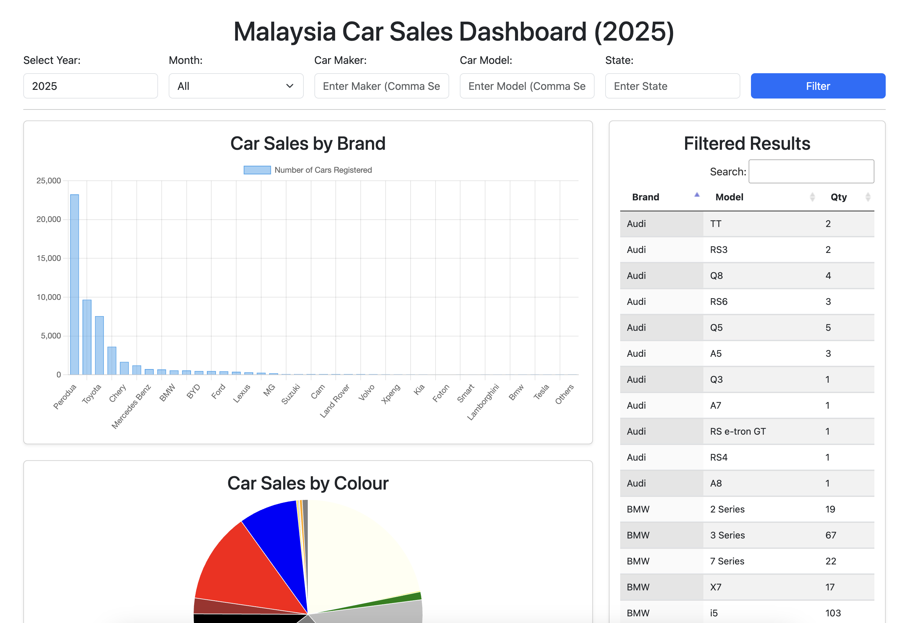

# Malaysia Car Sales Dashboard

<p align="center">
  
</p>

A Laravel-based dashboard for visualizing Malaysia's car sales data using a CSV dataset from the Department of Statistics Malaysia (DOSM).

## Features

-   **Filter by Year, Month, Maker, Model, and State**
-   **Interactive Bar & Pie Charts (Chart.js)**
-   **DataTables for Search & Pagination**
-   **Automatic CSV Fetching from [DOSM](https://data.gov.my/data-catalogue/registration_transactions_car)**
-   **Optimized for Large Datasets (Batch Processing & Memory Optimization)**

## Prerequisites

Ensure you have the following installed:

-   PHP (>=7.4)
-   Composer
-   Laravel (>=8.x)
-   Node.js & npm (for frontend assets)
-   Git
-   MySQL (or any database of choice)

## Installation Guide

### 1️⃣ Clone the Repository

```sh
git clone https://github.com/qusyairezwan/malaysiacarsales.git
cd malaysiacarsales
```

### 2️⃣ Install Dependencies

```sh
composer install
npm install
```

### 3️⃣ Set Up Environment Variables

```sh
cp .env.example .env
php artisan key:generate
```

### 4️⃣ Start Laravel Development Server

```sh
php artisan serve
```

Access the dashboard at: http://127.0.0.1:8000

## License

This project is licensed under the MIT License.

## Credits

Developed by Qusyaire Ezwan. Data sourced from DOSM (Department of Statistics Malaysia).

## Contributions

Feel free to contribute! Submit pull requests or open issues on GitHub.
